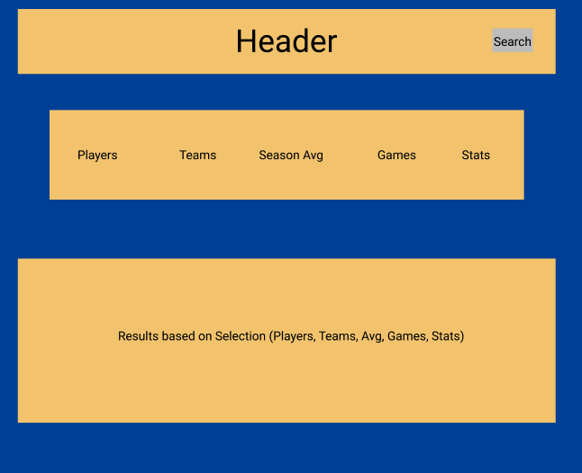

# NBA-Center
A place to find all you need about the NBA are there players! You can find all:
1) Players
2) Teams
3) Games
4) Season AVGs
5) Statistics

This is a React app. The app can be found [here]()

### Technologies Used
React, CSS, & Heroku
##### API
You can find the API [here!](https://www.balldontlie.io/)

## NBA-Center Overview
### Project Description
This project must meet 6 requirements:
1) The app must be fully functional & interactive React application.
2) It must include data from a third-party API.
3) It must have a minimum of 4 components.
4) It must be deployed on the web & have a link in this README.
5) This app must only consist of CSS Flexbox or Grid for layout strategies & it cannot be dependent on floats, position, or tables.
6) This repository must adequately document my project.
7) Git version control must be utilized with frequent commits dating back to the start of the project.

### User Stories
As a user, I will arrive at the NBA-Center's homepage. On said homepage, I will see a header with a search area & the page clickable title. The title, when clicked, will always take you back to the homepage. 

On the homepage, I will be able to see links for players, teams, games, season averages, & stats. When they click on one of those links, It will render all the information related to that link in a component on the page. For example, if I click players, I will be able to see all the players in the NBA.
## MVP Goals
1) Have each component render on the webpage.
2) Properly fetch the information from the API on the webpage
3) Deployed properly on the web
4) Have it styled to a minimum

## Stretch Goals
1) Have a Search function on the Navbar
2) Have a login feature for users to select favorite teams and/or players
3) Incorporate mobile-responsive UI styling

### Component Hierarchy

### Low-Fidelity Wireframes
